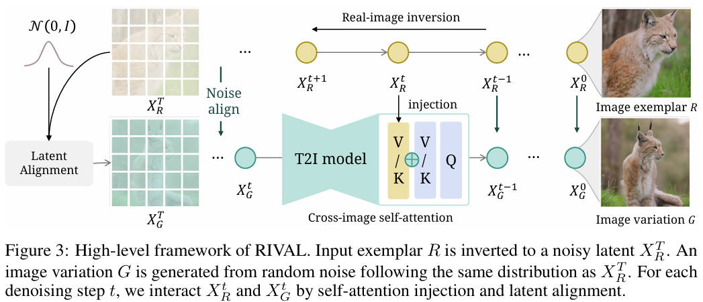

# Real-world Image Variation by ALignment (RIVAL)

[NeurIPS 2023 Spotlight] **Real-World Image Variation by Aligning Diffusion Inversion Chain**

> Yuechen Zhang, Jinbo Xing, Eric Lo, Jiaya Jia

> The Chinese University of Hong Kong, SmartMore

