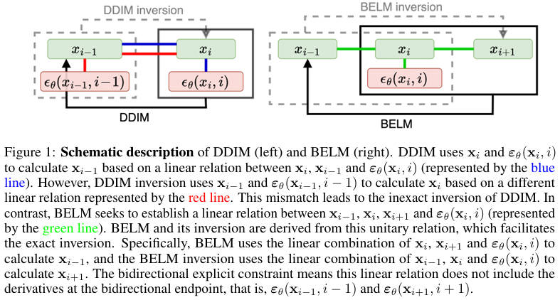

# Bidirectional Explicit Linear Multi-step (BELM)

[NeurlPS 2024] **BELM: Bidirectional Explicit Linear Multi-step Sampler for Exact Inversion in Diffusion Models**

> Fangyikang Wang, Hubery Yin, Yuejiang Dong, Huminhao Zhu, Chao Zhang, Hanbin Zhao, Hui Qian, Chen Li

> Zhejiang University, WeChat, Tsinghua University

