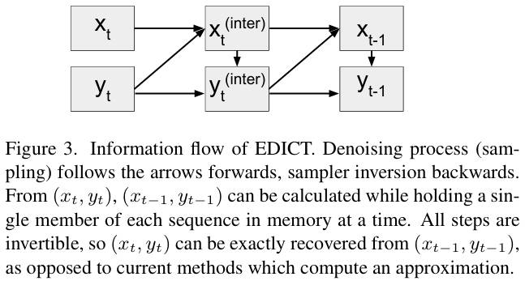

# Exact Diffusion Inversion via Coupled Transformations (EDICT)

[CVPR 2023] **EDICT: Exact Diffusion Inversion via Coupled Transformations**

> Bram Wallace, Akash Gokul, Nikhil Naik

> Salesforce Research

Denoising process:

$$
x_{t}^{inter} = a_{t} \cdot x_{t} + b_{t} \cdot \epsilon(y_{t}, t)
$$

$$
y_{t}^{inter} = a_{t} \cdot y_{t} + b_{t} \cdot \epsilon(x_{t}^{inter}, t)
$$

$$
x_{t-1} = p \cdot x_{t}^{inter} + (1 - p) \cdot y_{t}^{inter}
$$

$$
y_{t-1} = p \cdot y_{t}^{inter} + (1 - p) \cdot x_{t-1}
$$

Inversion process:

$$
y_{t+1}^{inter} = \frac{y_{t} - (1 - p) \cdot x_{t}}{p}
$$

$$
x_{t+1}^{inter} = \frac{x_{t} - (1 - p) \cdot y_{t+1}^{inter}}{p}
$$

$$
y_{t+1} = \frac{y_{t+1}^{inter} - b_{t+1} \cdot \epsilon(x_{t+1}^{inter}, t+1)}{a_{t+1}}
$$

$$
x_{t+1} = \frac{x_{t+1}^{inter} - b_{t+1} \cdot \epsilon(y_{t+1}, t+1)}{a_{t+1}}
$$
