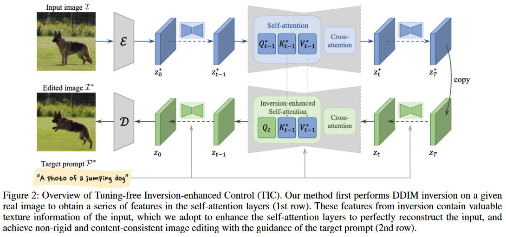

# Tuning-free Inversion-enhanced Control (TIC)

[AAAI 2024] **Tuning-Free Inversion-Enhanced Control for Consistent Image Editing**

> Ron Mokady, Amir Hertz, Kfir Aberman, Yael Pritch, Daniel Cohen-Or

> Google Research, Tel Aviv University

